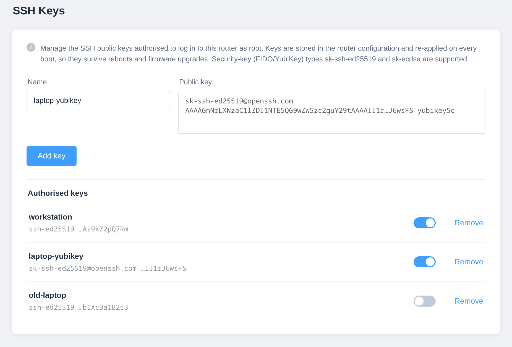

# glinet-sshkeymanagement

Add and remove the SSH public keys that may log in to a GL.iNet router, from the
router's own admin panel. Keys survive reboots and firmware upgrades.



> The image is a UI mockup, not yet a capture from a device.

## Install

On the router:

```sh
curl -fsSL https://digitalcybersoft.github.io/glinet-sshkeymanagement/setup.sh -o /tmp/setup.sh
sh /tmp/setup.sh
```

Then open **System → SSH Keys** in the panel.

## What it does

- Paste a public key to authorise it; remove or disable it later.
- Accepts `ssh-ed25519`, `ssh-rsa`, `ecdsa`, and FIDO/YubiKey `sk-ssh-ed25519` /
  `sk-ecdsa` keys.
- Keys live in `/etc/config/sshkeys` and are rendered into dropbear's
  `authorized_keys` as a managed block, leaving GL's own keys untouched.
- An init script re-applies them on every boot, and `keep.d` preserves them
  across firmware upgrades, so you are never locked out by an update.

## Packages

Both `Architecture: all`, served from one feed for every device:

- `gl-sdk4-sshkeys` — backend (rpc + uci store + boot renderer)
- `gl-sdk4-ui-sshkeysview` — the admin-panel view

## Build

```sh
tools/build_gui.sh                       # -> gui/*_all.ipk
tools/assemble_site.sh _site             # -> the Pages feed
```

`pages.yml` does both and deploys on every push to `main`.

## Status

Backend logic (key parser, managed-block renderer) is unit-tested. The panel
bundle has not yet been run on hardware: confirm the SPA routes the `sshkeysview`
view and that it lands under **System**.
